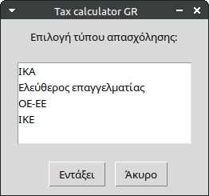
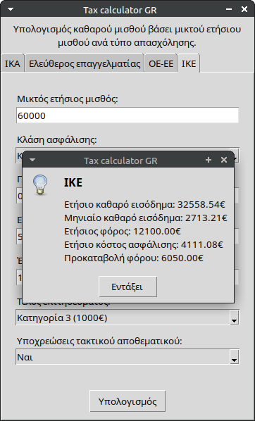

# Greek tax calculator

A command-line tool designed to calculate net income from an annual gross salary in Greece. By entering your gross
salary and selecting an employment type, the tool applies Greek tax regulations to provide an estimate of your net
income. This tool is ideal for employees, freelancers, and contractors who need quick insights into their take-home pay.

## Features

* Estimate net salary with adjustments for expenses, prepaid tax, and more.
* Supports multiple employment types:
  - [x] Employee (IKA)
  - [x] Freelancer
  - [X] IKE
  - [x] OE / EE
* Supports multiple user interfaces:
  - [x] Graphical user interface
  - [x] Command-line
  - [x] Interactive shell
* Multilingual support (via LANG environment variable).


## Getting Started

### Command-Line Mode

Run the tool directly with all required parameters:

```shell
./bin/tax-calculator --user-interface cli --employment-type ika --annual-gross-salary 30000 --salaries-count 14 --kids-number 1
```

You can also handle multiple employment types simultaneously:

```shell
./bin/tax-calculator --user-interface cli \
  --employment-type ika freelancer \
  --annual-gross-salary 50000 \
  --salaries-count 14 \
  --kids-number 1 \
  --expenses 3000 \
  --prepaid-tax 0 \
  --functional-year 1 \
  --monthly-insurance-cost 238.22
```

### Interactive Mode

#### Setup Virtual Environment

1. Create and activate a virtual environment:
    ```shell
    python -m venv venv
    source venv/bin/activate
    ```
2. Install dependencies:
    ```shell
    pip install -r requirements.txt
    ```

#### Run Interactive Shell

Use the interactive shell to input options step by step, optionally providing default values:

```shell
./bin/tax-calculator --user-interface shell --employment-type ika --annual-gross-salary 50000
```

### Graphical User Interface (GUI)

Run the GUI to interact with a graphical interface. Ensure the python3-tk package is installed on your system:

```shell
./bin/tax-calculator -u gui -e ika
```

## Translations

Compile translations with:

```shell
make compilemessages
```

To force a specific language (e.g., Greek), set the LANG environment variable:

```shell
LANG=el_GR ./bin/tax-calculator -u gui -e ika
```

## Screenshots





## Disclaimer

Please note that the calculations provided are estimates based on general tax rules and may not be fully accurate.
This tool is not a substitute for professional accounting advice. Users should consult a certified accountant for
precise tax calculations.
The authors of this tool are not liable for any inaccuracies or financial outcomes resulting from its use.
